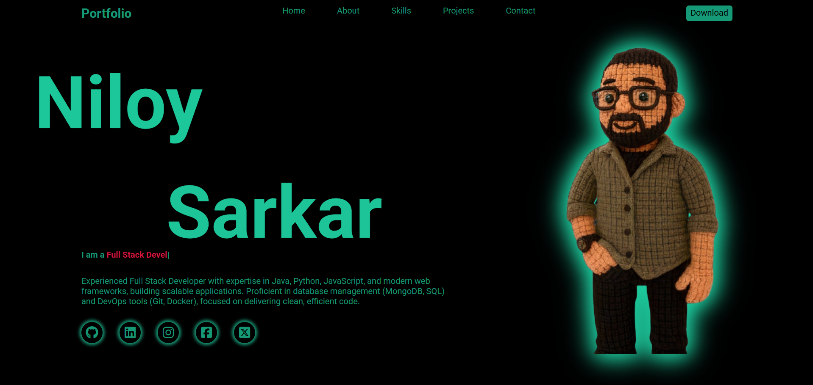

# 💼 Niloy Sarkar - Developer Portfolio

This is my personal **developer portfolio** website built using HTML, CSS, and JavaScript. It showcases my projects, skills, and contact information in a clean, modern, and interactive design.

## 🌐 Live Preview

[View Portfolio](https://niloyns.github.io/Portfolio_2.0/) <!-- Replace with your actual link -->

---



---

## 📸 Features

- 🎯 Smooth scroll animations using **GSAP**
- 🎨 Glassmorphism design with **#1dcd9f** accent
- 💻 Horizontal skill slider with **infinite scroll**
- 📱 Responsive layout for all devices
- 📩 Contact section with animation on scroll
- 📩 You can Send E-Mail using contact section

---

## 🛠️ Technologies Used

- HTML5
- CSS3
- JavaScript (Vanilla)
- Font Awesome Icons
- GSAP (ScrollTrigger)

---

## 📂 Folder Structure

```bash
root/
├── index.html
├── style.css
├── script.js
└── assets/
    └── images/
```

## 📈 Optimized For

- Performance
- Accessibility
- Mobile Responsiveness
- Clean Code and Readability

---

## 📬 Contact

If you like my work or want to collaborate, feel free to reach out!

- 💼 [LinkedIn](https://www.linkedin.com/in/niloy-ns/)
- 🐙 [GitHub](https://github.com/Niloyns/Portfolio_2.0)
- 📧 Email: niloysarkar1998@gmail.com

---

## 📌 License

This project is open source and available under the [Niloy](LICENSE).

```

```
